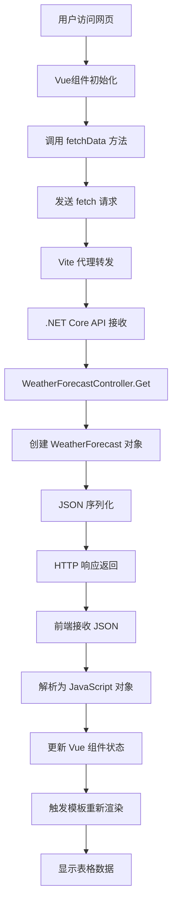

# WeatherForecast 数据流分析

## 📋 概述

本文档详细分析了 `WeatherForecast` 类从后端 .NET Core API 到前端 Vue.js 应用的完整数据传输和渲染过程。

## 🏗️ 项目架构

```
┌─────────────────────────────────────────────────────────────────┐
│                        项目结构                                    │
├─────────────────────────────────────────────────────────────────┤
│  VueApp1.sln                                                   │
│  ├── VueApp1.Server (后端 .NET Core API)                        │
│  │   ├── WeatherForecast.cs                                   │
│  │   ├── Controllers/WeatherForecastController.cs             │
│  │   └── Program.cs                                           │
│  └── vueapp1.client (前端 Vue.js)                              │
│      ├── src/components/HelloWorld.vue                         │
│      ├── vite.config.ts                                        │
│      └── package.json                                          │
└─────────────────────────────────────────────────────────────────┘
```

## 🔄 完整数据流程

### 1. 后端数据模型定义

**文件**: `VueApp1.Server/WeatherForecast.cs`

```csharp
namespace VueApp1.Server
{
    public class WeatherForecast
    {
        public DateOnly Date { get; set; }           // 日期
        public int TemperatureC { get; set; }        // 摄氏温度
        public int TemperatureF => 32 + (int)(TemperatureC / 0.5556); // 华氏温度（计算属性）
        public string? Summary { get; set; }         // 天气描述
    }
}
```

**作用**:
- 定义天气预报的数据结构
- `TemperatureF` 是计算属性，自动从摄氏温度转换
- 使用 `DateOnly` 类型处理日期（.NET 6+）

### 2. API 控制器实现

**文件**: `VueApp1.Server/Controllers/WeatherForecastController.cs`

```csharp
[ApiController]
[Route("[controller]")]  // 路由映射到 /weatherforecast
public class WeatherForecastController : ControllerBase
{
    private static readonly string[] Summaries = new[]
    {
        "Freezing", "Bracing", "Chilly", "Cool", "Mild", 
        "Warm", "Balmy", "Hot", "Sweltering", "Scorching"
    };

    [HttpGet(Name = "GetWeatherForecast")]
    public IEnumerable<WeatherForecast> Get()
    {
        return Enumerable.Range(1, 5).Select(index => new WeatherForecast
        {
            Date = DateOnly.FromDateTime(DateTime.Now.AddDays(index)),
            TemperatureC = Random.Shared.Next(-20, 55),
            Summary = Summaries[Random.Shared.Next(Summaries.Length)]
        }).ToArray();
    }
}
```

**执行过程**:
1. 生成 5 个随机的天气预报对象
2. 日期为当前日期后的 1-5 天
3. 温度范围：-20°C 到 55°C
4. 随机选择天气描述

### 3. JSON 序列化

当客户端发送 HTTP GET 请求到 `/weatherforecast` 时，ASP.NET Core 自动将 `WeatherForecast` 对象序列化为 JSON：

```json
[
  {
    "date": "2025-08-20",
    "temperatureC": -4,
    "temperatureF": 25,
    "summary": "Sweltering"
  },
  {
    "date": "2025-08-21",
    "temperatureC": 45,
    "temperatureF": 112,
    "summary": "Cool"
  },
  {
    "date": "2025-08-22",
    "temperatureC": 6,
    "temperatureF": 42,
    "summary": "Freezing"
  }
  // ... 其他对象
]
```

**序列化规则**:
- 属性名转换为小写开头的驼峰命名 (`Date` → `date`)
- 计算属性也被序列化 (`TemperatureF`)
- `DateOnly` 转换为 ISO 8601 日期字符串

### 4. 前端代理配置

**文件**: `vueapp1.client/vite.config.ts`

```typescript
const target = env.ASPNETCORE_HTTPS_PORT ? `https://localhost:${env.ASPNETCORE_HTTPS_PORT}` :
    env.ASPNETCORE_URLS ? env.ASPNETCORE_URLS.split(';')[0] : 'http://localhost:5297';

export default defineConfig({
    server: {
        proxy: {
            '^/weatherforecast': {
                target,          // 目标服务器地址
                secure: false    // 允许不安全的 HTTPS 证书
            }
        },
        port: parseInt(env.DEV_SERVER_PORT || '5156')
    }
})
```

**代理工作原理**:
- 前端运行在 `https://localhost:5157`
- 后端运行在 `http://localhost:5297`
- 当前端发送 `/weatherforecast` 请求时，Vite 自动转发到后端

### 5. 前端类型定义

**文件**: `vueapp1.client/src/components/HelloWorld.vue`

```typescript
type Forecasts = {
    date: string,
    temperatureC: string,
    temperatureF: string,
    summary: string
}[];

interface Data {
    loading: boolean,
    post: null | Forecasts
}
```

**类型安全**:
- TypeScript 确保数据结构的一致性
- 前端类型与后端 JSON 结构匹配
- 提供编译时错误检查

### 6. 数据获取逻辑

**文件**: `vueapp1.client/src/components/HelloWorld.vue`

```typescript
export default defineComponent({
    data(): Data {
        return {
            loading: false,
            post: null
        };
    },
    async created() {
        // 组件创建时自动获取数据
        await this.fetchData();
    },
    methods: {
        async fetchData() {
            this.post = null;
            this.loading = true;

            try {
                var response = await fetch('weatherforecast');
                if (response.ok) {
                    this.post = await response.json();
                    this.loading = false;
                }
            } catch (error) {
                console.error('Failed to fetch weather data:', error);
                this.loading = false;
            }
        }
    }
});
```

**执行步骤**:
1. **组件初始化**: `created()` 钩子触发
2. **发送请求**: `fetch('weatherforecast')`
3. **代理转发**: Vite 将请求转发到后端
4. **接收响应**: 获取 JSON 数据
5. **解析数据**: `response.json()` 转换为 JavaScript 对象
6. **更新状态**: 设置 `this.post` 和 `this.loading`

### 7. Vue 模板渲染

**文件**: `vueapp1.client/src/components/HelloWorld.vue`

```vue
<template>
    <div class="weather-component">
        <h1>Weather forecast</h1>
        <p>This component demonstrates fetching data from the server.</p>

        <!-- 加载状态 -->
        <div v-if="loading" class="loading">
            Loading... Please refresh once the ASP.NET backend has started.
        </div>

        <!-- 数据展示 -->
        <div v-if="post" class="content">
            <table>
                <thead>
                    <tr>
                        <th>Date</th>
                        <th>Temp. (C)</th>
                        <th>Temp. (F)</th>
                        <th>Summary</th>
                    </tr>
                </thead>
                <tbody>
                    <tr v-for="forecast in post" :key="forecast.date">
                        <td>{{ forecast.date }}</td>
                        <td>{{ forecast.temperatureC }}</td>
                        <td>{{ forecast.temperatureF }}</td>
                        <td>{{ forecast.summary }}</td>
                    </tr>
                </tbody>
            </table>
        </div>
    </div>
</template>
```

**渲染机制**:
- **条件渲染**: `v-if="loading"` 和 `v-if="post"`
- **列表渲染**: `v-for="forecast in post"`
- **数据绑定**: `{{ forecast.date }}` 等插值表达式
- **响应式更新**: 数据变化自动更新 DOM

## 🔗 完整数据流图



## 🌐 网络请求详情

### 请求流程
```
前端应用 (https://localhost:5157)
    ↓ fetch('weatherforecast')
Vite 开发服务器 (代理)
    ↓ HTTP GET http://localhost:5297/weatherforecast
.NET Core API (http://localhost:5297)
    ↓ WeatherForecastController.Get()
生成随机数据
    ↓ JSON 序列化
返回 HTTP 200 + JSON 数据
    ↓ 代理转发
前端接收并解析 JSON
    ↓ Vue 响应式更新
DOM 更新，用户看到表格
```

### 典型的 HTTP 响应
```http
HTTP/1.1 200 OK
Content-Type: application/json; charset=utf-8
Date: Mon, 19 Aug 2025 09:00:00 GMT

[
  {
    "date": "2025-08-20",
    "temperatureC": -4,
    "temperatureF": 25,
    "summary": "Sweltering"
  }
]
```

## ⚡ 关键技术点

### 1. 跨域处理
- **开发环境**: Vite 代理解决跨域问题
- **生产环境**: 需要配置 CORS 或同域部署

### 2. 类型转换
- **C# DateOnly** → **JSON String** → **JavaScript String**
- **C# int** → **JSON Number** → **JavaScript Number**
- **C# string** → **JSON String** → **JavaScript String**

### 3. 异步处理
- 前端使用 `async/await` 处理异步请求
- Vue 的响应式系统自动处理状态更新

### 4. 错误处理
- 网络错误处理
- JSON 解析错误处理
- 组件状态管理

## 🚀 性能优化建议

1. **缓存策略**: 可以添加客户端缓存
2. **加载优化**: 实现骨架屏或更好的加载动画
3. **错误重试**: 添加自动重试机制
4. **数据分页**: 大量数据时实现分页加载

## 📝 总结

`WeatherForecast` 类从后端到前端的数据流涉及：
1. **后端数据建模** - C# 类定义
2. **API 端点暴露** - HTTP GET 接口
3. **JSON 序列化** - 自动转换格式
4. **前端代理** - 解决跨域问题
5. **HTTP 请求** - 获取数据
6. **数据解析** - JSON 转 JavaScript 对象
7. **模板渲染** - Vue 响应式显示

这个过程展示了现代 Web 应用中前后端分离架构的典型数据交互模式。
