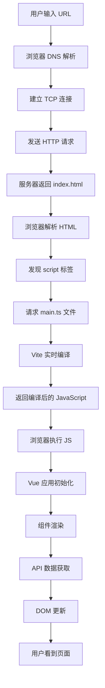

# 浏览器访问到前端渲染全流程详解

## 📋 概述

本文档详细介绍了用户在浏览器中访问 Vue.js 应用，从输入 URL 到看到完整页面的整个渲染流程，涵盖网络请求、文件加载、编译处理、JavaScript 执行、DOM 渲染等各个环节。

---

## 🌊 完整渲染流程概览



---

## 🚀 详细流程步骤

### 第一阶段：网络层面

#### 1. 用户访问 (0ms)
```
用户操作：在浏览器地址栏输入 https://localhost:5157
浏览器状态：开始解析 URL
```

#### 2. DNS 解析 (1-5ms)
```
过程：localhost → 127.0.0.1
结果：获得服务器 IP 地址
缓存：浏览器/操作系统 DNS 缓存
```

#### 3. 建立连接 (5-10ms)
```
TCP 连接：浏览器 ←→ Vite 开发服务器 (端口 5157)
HTTPS 握手：SSL/TLS 证书验证
连接池：复用现有连接或建立新连接
```

#### 4. HTTP 请求 (10-15ms)
```
请求方法：GET /
请求头：
  Host: localhost:5157
  User-Agent: Mozilla/5.0 ...
  Accept: text/html,application/xhtml+xml...
  Accept-Language: zh-CN,zh;q=0.9
```

### 第二阶段：HTML 处理

#### 5. 服务器响应 (15-20ms)
```
HTTP/1.1 200 OK
Content-Type: text/html; charset=UTF-8
Content-Length: 234

<!DOCTYPE html>
<html lang="">
<head>
  <meta charset="UTF-8">
  <link rel="icon" href="/favicon.ico">
  <meta name="viewport" content="width=device-width, initial-scale=1.0">
  <title>Vite App</title>
</head>
<body>
  <div id="app"></div>
  <script type="module" src="/src/main.ts"></script>
</body>
</html>
```

#### 6. 浏览器解析 HTML (20-25ms)
```
解析过程：
├─ 构建 DOM 树
├─ 解析 <head> 部分
│  ├─ 设置文档字符集 (UTF-8)
│  ├─ 请求 favicon.ico
│  ├─ 设置视口元数据
│  └─ 设置文档标题
├─ 解析 <body> 部分
│  ├─ 创建 <div id="app"> 元素
│  └─ 发现 <script type="module" src="/src/main.ts">
└─ 触发模块脚本加载
```

### 第三阶段：模块加载和编译

#### 7. 请求主模块 (25-30ms)
```
浏览器发起请求：GET /src/main.ts
请求头：
  Accept: */*
  Referer: https://localhost:5157/
```

#### 8. Vite 编译处理 (30-100ms)
```
Vite 服务器处理：
├─ 接收 /src/main.ts 请求
├─ 读取源文件
├─ 解析 TypeScript
├─ 处理 import 语句
│  ├─ import './assets/main.css'
│  ├─ import { createApp } from 'vue'
│  └─ import App from './App.vue'
├─ 编译 TypeScript → JavaScript
├─ 处理依赖关系
└─ 返回编译后的代码
```

#### 9. 返回编译结果 (100-110ms)
```javascript
// 编译后返回给浏览器的代码
import "./assets/main.css";
import { createApp } from "/node_modules/.vite/deps/vue.js?v=12345";
import App from "/src/App.vue";

createApp(App).mount('#app');
```

### 第四阶段：依赖加载

#### 10. 并行加载依赖 (110-200ms)
```
浏览器并行发起多个请求：
├─ GET /assets/main.css               (样式文件)
├─ GET /node_modules/.vite/deps/vue.js (Vue 框架)
└─ GET /src/App.vue                   (根组件)

每个请求都经过 Vite 编译处理：
├─ CSS 文件：直接返回或经过预处理器处理
├─ Vue 框架：预构建的依赖
└─ .vue 文件：编译为 JavaScript 模块
```

#### 11. Vue 组件编译 (150-250ms)
```
App.vue 编译过程：
├─ 解析 <template> → render 函数
├─ 解析 <script setup> → 组件逻辑
├─ 解析 <style scoped> → CSS 样式
└─ 生成最终的 JavaScript 模块

编译后的 App.vue：
export default {
  name: 'App',
  render() { /* 渲染函数 */ },
  setup() { /* 组件逻辑 */ }
}
```

#### 12. 子组件递归加载 (200-400ms)
```
App.vue 依赖的组件：
├─ GET /src/components/HelloWorld.vue
└─ GET /src/components/TheWelcome.vue
    ├─ GET /src/components/WelcomeItem.vue
    └─ GET /src/components/icons/*.vue (5个图标组件)

每个组件都经过相同的编译流程
```

### 第五阶段：JavaScript 执行

#### 13. Vue 应用初始化 (400-450ms)
```javascript
// 浏览器执行编译后的 main.js
import { createApp } from 'vue';
import App from './App.vue';

// 1. 创建 Vue 应用实例
const app = createApp(App);

// 2. 挂载到 DOM
app.mount('#app');
```

#### 14. 组件实例化 (450-500ms)
```
Vue 内部处理：
├─ 创建 App 根组件实例
├─ 解析组件依赖树
│  ├─ App
│  │  ├─ HelloWorld
│  │  └─ TheWelcome
│  │     ├─ WelcomeItem (×5)
│  │     └─ Icon* (×5)
├─ 初始化响应式数据系统
├─ 设置组件生命周期钩子
└─ 准备渲染函数
```

### 第六阶段：DOM 渲染

#### 15. 首次渲染 (500-600ms)
```
渲染过程：
├─ 执行根组件渲染函数
├─ 生成虚拟 DOM 树
├─ 创建实际 DOM 元素
│  ├─ <header> 元素
│  │  ├─ 
│  │  └─ <div class="wrapper">
│  │     └─ HelloWorld 组件 DOM
│  └─ <main> 元素
│     └─ TheWelcome 组件 DOM
├─ 应用 CSS 样式
│  ├─ 全局样式 (main.css)
│  ├─ 组件作用域样式
│  └─ 响应式媒体查询
└─ 插入到 <div id="app"> 中
```

#### 16. 生命周期钩子执行 (600-650ms)
```
组件生命周期：
├─ App: beforeCreate → created → beforeMount → mounted
├─ HelloWorld: created → mounted → fetchData()
└─ TheWelcome: created → mounted
    ├─ WelcomeItem (×5): created → mounted
    └─ Icon* (×5): created → mounted
```

### 第七阶段：数据获取和更新

#### 17. API 数据请求 (简化流程)
```
HelloWorld 组件的 fetchData 方法：
├─ 发起请求：fetch('/weatherforecast')
├─ Vite 代理转发到后端
├─ 后端返回 JSON 数据
├─ 前端接收并解析数据
└─ 更新组件状态
```

#### 18. 响应式更新 (650-700ms)
```
数据更新流程：
├─ 组件状态变更 (loading: false, post: data)
├─ 触发响应式系统
├─ 重新执行渲染函数
├─ 生成新的虚拟 DOM
├─ 与旧虚拟 DOM 对比 (diff)
├─ 计算最小更新集
└─ 更新实际 DOM
```

---

## 🕰️ 时间线详解

### 完整时间线 (毫秒级)

```
0ms     │ 用户输入 URL，按下回车
        │
5ms     │ DNS 解析完成
        │
15ms    │ 建立 HTTPS 连接
        │
20ms    │ 发送第一个 HTTP 请求
        │
25ms    │ 接收到 index.html
        │ 浏览器开始解析 HTML
        │
30ms    │ 解析完成，发现 script 标签
        │ 发起 main.ts 请求
        │
100ms   │ Vite 编译完成，返回 main.js
        │ 浏览器开始执行 JavaScript
        │
110ms   │ 并行加载依赖：
        │ ├─ CSS 样式
        │ ├─ Vue 框架
        │ └─ Vue 组件
        │
400ms   │ 所有依赖加载完成
        │ Vue 应用开始初始化
        │
500ms   │ 首次 DOM 渲染完成
        │ 用户看到页面结构
        │
600ms   │ 组件生命周期完成
        │ API 数据请求发起
        │
700ms   │ 数据返回，页面最终渲染完成
        │ 用户看到完整的功能页面
```

### 性能关键点

| 时间段 | 关键操作 | 影响因素 | 优化策略 |
|--------|----------|----------|----------|
| 0-30ms | 网络连接 | 网络延迟、DNS | CDN、DNS 预解析 |
| 30-400ms | 资源加载编译 | 文件大小、编译速度 | 代码分割、缓存 |
| 400-500ms | JS 执行 | 代码复杂度 | Tree Shaking |
| 500-600ms | DOM 渲染 | DOM 复杂度 | 虚拟滚动 |
| 600-700ms | 数据获取 | API 响应时间 | 预加载、缓存 |

---

## 🔍 浏览器开发者工具视角

### 1. Network 面板时间线

```
Name                    Status  Type        Size    Time    Waterfall
/ (document)            200     document    234B    25ms    ████
src/main.ts             200     script      892B    75ms      ██████
assets/main.css         200     stylesheet  1.2KB   45ms        ███
vue.js                  200     script      34KB    120ms         ████████
src/App.vue             200     script      1.5KB   80ms        ██████
HelloWorld.vue          200     script      2.8KB   85ms         ███████
TheWelcome.vue          200     script      3.1KB   90ms          ████████
WelcomeItem.vue         200     script      786B    65ms         █████
icons/Icon*.vue (×5)    200     script      ~500B   60ms         ████
weatherforecast         200     xhr         1.1KB   125ms               ████████
```

### 2. Performance 面板分析

```
主线程活动：
┌─ Parse HTML (5ms)
├─ Evaluate Script: main.js (15ms)
├─ Compile: Vue components (150ms)
├─ Layout (25ms)
├─ Paint (30ms)
├─ Composite Layers (10ms)
└─ API Call & Update (50ms)

内存使用：
├─ JavaScript Heap: ~8MB
├─ DOM Nodes: ~150 个
└─ Event Listeners: ~12 个
```

### 3. Elements 面板最终结构

```html
<html lang="">
<head>
  <title>Vite App</title>
  <style>/* 编译后的所有 CSS 样式 */</style>
</head>
<body>
  <div id="app">
    <!-- Vue 应用渲染的完整 DOM 结构 -->
    <header>
      
      <div class="wrapper">
        <div class="weather-component" data-v-7ba5bd90>
          <h1>Weather forecast</h1>
          <div class="content">
            <table>
              <tbody>
                <tr><td>2025-08-22</td><td>25</td><td>77</td><td>Warm</td></tr>
                <!-- 动态渲染的天气数据 -->
              </tbody>
            </table>
          </div>
        </div>
      </div>
    </header>
    <main>
      <!-- TheWelcome 组件的 DOM 内容 -->
      <div class="item">
        <i><svg><!-- 图标 SVG --></svg></i>
        <div class="details">
          <h3>Documentation</h3>
          <p>Vue's official documentation...</p>
        </div>
      </div>
    </main>
  </div>
</body>
</html>
```

---

