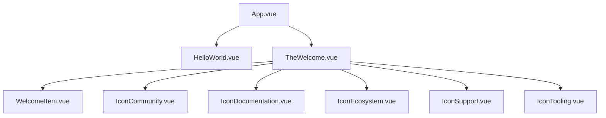

# Vue.js 组件 Import 和使用机制详解

## 📋 概述

在 Vue.js 中，`import` 语句是 ES6 模块系统的一部分，用于将其他文件中的代码导入到当前文件中。对于 Vue 组件来说，这是组件复用和模块化开发的基础。

---

## 🔍 Import 语句详解

### 在 App.vue 中的 Import 示例

```vue
<script setup lang="ts">
import HelloWorld from './components/HelloWorld.vue'
import TheWelcome from './components/TheWelcome.vue'
</script>
```

### Import 语句的作用

1. **模块导入**: 将其他文件导出的内容导入到当前文件
2. **依赖声明**: 明确声明当前组件依赖哪些其他组件
3. **类型支持**: 在 TypeScript 中提供类型检查和智能提示
4. **构建优化**: 让打包工具知道模块间的依赖关系，进行优化

### Import 语法解析

```typescript
import [组件名称] from [文件路径]
```

- **组件名称**: 在当前文件中使用的名称（可以与导出名称不同）
- **文件路径**: 相对或绝对路径，指向要导入的文件
- **from**: ES6 关键字，表示"从...导入"

---

## 🏗️ 组件使用规则

### 1. 在 `<script setup>` 中的使用（推荐方式）

```vue
<script setup lang="ts">
// 1. 导入组件
import HelloWorld from './components/HelloWorld.vue'
import TheWelcome from './components/TheWelcome.vue'

// 导入后的组件自动在模板中可用，无需额外注册
</script>

<template>
  <!-- 2. 在模板中直接使用 -->
  <HelloWorld msg="You did it!" />
  <TheWelcome />
</template>
```

**特点**:
- ✅ **自动注册**: 导入的组件自动在模板中可用
- ✅ **类型安全**: TypeScript 支持完整的类型检查
- ✅ **简洁语法**: 不需要手动在 components 选项中注册

### 2. 在传统 Options API 中的使用

```vue
<script lang="ts">
import { defineComponent } from 'vue'
import HelloWorld from './components/HelloWorld.vue'
import TheWelcome from './components/TheWelcome.vue'

export default defineComponent({
  name: 'App',
  components: {
    // 需要手动注册组件
    HelloWorld,
    TheWelcome
  }
})
</script>

<template>
  <HelloWorld msg="You did it!" />
  <TheWelcome />
</template>
```

**特点**:
- 📝 **手动注册**: 需要在 components 选项中注册
- 📚 **传统语法**: 适合老项目或熟悉 Options API 的开发者

---

## 📐 组件命名规则

### 1. 文件命名规范

```
推荐的文件命名方式：
✅ PascalCase: HelloWorld.vue, TheWelcome.vue
✅ kebab-case: hello-world.vue, the-welcome.vue

不推荐：
❌ camelCase: helloWorld.vue
❌ snake_case: hello_world.vue
```

### 2. Import 名称规范

```typescript
// 推荐：使用 PascalCase
import HelloWorld from './components/HelloWorld.vue'
import TheWelcome from './components/TheWelcome.vue'
import MyCustomButton from './components/MyCustomButton.vue'

// 可以重命名
import HW from './components/HelloWorld.vue'  // 重命名为 HW
import Welcome from './components/TheWelcome.vue'  // 重命名为 Welcome
```

### 3. 模板中的使用规范

```vue
<template>
  <!-- 推荐：PascalCase -->
  <HelloWorld msg="Hello" />
  <TheWelcome />
  
  <!-- 也支持：kebab-case -->
  <hello-world msg="Hello" />
  <the-welcome />
  
  <!-- 自闭合标签（推荐） -->
  <HelloWorld msg="Hello" />
  
  <!-- 完整标签 -->
  <HelloWorld msg="Hello"></HelloWorld>
</template>
```

---

## 🆕 创建和添加新组件

### 步骤 1: 创建新组件文件

```vue
<!-- 文件路径: src/components/MyNewComponent.vue -->
<script setup lang="ts">
// 定义 props
interface Props {
  title: string
  count?: number
}

// 接收 props
const props = withDefaults(defineProps<Props>(), {
  count: 0
})

// 定义响应式数据
import { ref } from 'vue'
const isVisible = ref(true)

// 定义方法
const handleClick = () => {
  console.log('Button clicked!')
  isVisible.value = !isVisible.value
}
</script>

<template>
  <div class="my-component" v-if="isVisible">
    <h3>{{ title }}</h3>
    <p>Count: {{ count }}</p>
    <button @click="handleClick">Toggle Visibility</button>
  </div>
</template>

<style scoped>
.my-component {
  padding: 1rem;
  border: 1px solid #ccc;
  border-radius: 8px;
  margin: 1rem 0;
}

h3 {
  color: #42b883;
  margin: 0 0 0.5rem 0;
}
</style>
```

### 步骤 2: 在父组件中导入和使用

```vue
<!-- App.vue -->
<script setup lang="ts">
import HelloWorld from './components/HelloWorld.vue'
import TheWelcome from './components/TheWelcome.vue'
// 添加新组件的导入
import MyNewComponent from './components/MyNewComponent.vue'
</script>

<template>
  <header>
    

    <div class="wrapper">
      <HelloWorld msg="You did it!" />
    </div>
  </header>

  <main>
    <TheWelcome />
    
    <!-- 使用新组件 -->
    <MyNewComponent 
      title="这是我的新组件" 
      :count="42" 
    />
  </main>
</template>
```

---

## 🎯 导入路径规则

### 1. 相对路径

```typescript
// 当前目录
import HelloWorld from './HelloWorld.vue'

// 上级目录
import HelloWorld from '../HelloWorld.vue'

// 子目录
import HelloWorld from './components/HelloWorld.vue'

// 多级目录
import HelloWorld from './components/forms/HelloWorld.vue'
```

### 2. 绝对路径（使用别名）

```typescript
// 使用 @ 别名（指向 src 目录）
import HelloWorld from '@/components/HelloWorld.vue'
import utils from '@/utils/helpers'
import type { User } from '@/types/user'
```

**别名配置** (在 `vite.config.ts` 中):
```typescript
export default defineConfig({
  resolve: {
    alias: {
      '@': fileURLToPath(new URL('./src', import.meta.url))
    }
  }
})
```

### 3. Node Modules 导入

```typescript
// 第三方组件库
import { Button, Input } from 'ant-design-vue'
import ElementPlus from 'element-plus'

// Vue 核心
import { ref, computed, onMounted } from 'vue'
```

---

## 🔄 组件的 Export 和 Import 机制

### 组件的默认导出

```vue
<!-- HelloWorld.vue -->
<script setup lang="ts">
// Composition API with <script setup>
// 这种方式自动导出组件
</script>

<!-- 等价于传统方式： -->
<script lang="ts">
import { defineComponent } from 'vue'

export default defineComponent({
  name: 'HelloWorld',
  // ... 组件选项
})
</script>
```

### 组件的命名导出（较少使用）

```typescript
// utils/components.ts
export { default as HelloWorld } from './HelloWorld.vue'
export { default as TheWelcome } from './TheWelcome.vue'

// 在其他文件中导入
import { HelloWorld, TheWelcome } from '@/utils/components'
```

---

## 📦 组件组织最佳实践

### 1. 目录结构

```
src/
├── components/           # 公共组件
│   ├── common/          # 通用组件
│   │   ├── Button.vue
│   │   ├── Input.vue
│   │   └── Modal.vue
│   ├── layout/          # 布局组件
│   │   ├── Header.vue
│   │   ├── Footer.vue
│   │   └── Sidebar.vue
│   ├── forms/           # 表单组件
│   │   ├── LoginForm.vue
│   │   └── ContactForm.vue
│   └── icons/           # 图标组件
│       ├── IconHome.vue
│       └── IconUser.vue
├── views/               # 页面组件
│   ├── Home.vue
│   ├── About.vue
│   └── Contact.vue
└── App.vue             # 根组件
```

### 2. 组件导入优化

```typescript
// 批量导入 (创建 index.ts)
// components/common/index.ts
export { default as Button } from './Button.vue'
export { default as Input } from './Input.vue'
export { default as Modal } from './Modal.vue'

// 使用时
import { Button, Input, Modal } from '@/components/common'
```

### 3. 懒加载组件

```typescript
// 路由级懒加载
const Home = () => import('@/views/Home.vue')
const About = () => import('@/views/About.vue')

// 组件级懒加载
const AsyncComponent = defineAsyncComponent(() => 
  import('@/components/HeavyComponent.vue')
)
```

---

## 🛠️ 开发工具支持

### 1. VS Code 插件推荐

- **Vetur**: Vue 2 支持 (已废弃)
- **Volar**: Vue 3 官方推荐
- **Auto Import - ES6, TS, JSX, TSX**: 自动导入支持

### 2. 自动导入配置

使用 `unplugin-auto-import` 插件：

```typescript
// vite.config.ts
import AutoImport from 'unplugin-auto-import/vite'

export default defineConfig({
  plugins: [
    AutoImport({
      imports: ['vue'],
      dts: true // 生成类型定义
    })
  ]
})
```

配置后可以直接使用 Vue API 而不需要导入：

```vue
<script setup lang="ts">
// 不需要 import { ref } from 'vue'
const count = ref(0)
const doubled = computed(() => count.value * 2)
</script>
```

---

## 🔍 实际案例分析

### 当前项目中的组件关系



### HelloWorld.vue 的使用方式

```vue
<!-- App.vue 中 -->
<HelloWorld msg="You did it!" />
```

**属性传递**:
- `msg`: 字符串属性，传递给子组件
- 使用了 props 系统进行父子组件通信

### TheWelcome.vue 的使用方式

```vue
<!-- App.vue 中 -->
<TheWelcome />
```

**特点**:
- 无需传递属性
- 自包含的组件，内部管理自己的状态和子组件

---

## 💡 常见问题和解决方案

### 1. 导入路径错误

```typescript
// ❌ 错误
import HelloWorld from 'components/HelloWorld.vue'

// ✅ 正确
import HelloWorld from './components/HelloWorld.vue'
// 或者使用别名
import HelloWorld from '@/components/HelloWorld.vue'
```

### 2. 组件名称冲突

```typescript
// ❌ 问题：两个组件同名
import Button from './Button.vue'
import Button from './AnotherButton.vue'  // 错误！

// ✅ 解决：重命名导入
import Button from './Button.vue'
import AnotherButton from './AnotherButton.vue'

// 或者使用别名
import { Button as MyButton } from './Button.vue'
import { Button as OtherButton } from './AnotherButton.vue'
```

### 3. TypeScript 类型问题

```typescript
// 确保安装了 Vue 类型定义
npm install --save-dev @vue/tsconfig

// 在 tsconfig.json 中配置
{
  "extends": "@vue/tsconfig/tsconfig.dom.json",
  "compilerOptions": {
    "moduleResolution": "node",
    "allowImportingTsExtensions": true
  }
}
```

### 4. 动态组件导入

```vue
<script setup lang="ts">
import { defineAsyncComponent } from 'vue'

// 动态导入组件
const DynamicComponent = defineAsyncComponent(() => {
  if (someCondition) {
    return import('./ComponentA.vue')
  } else {
    return import('./ComponentB.vue')
  }
})
</script>
```

---

## 📋 总结

### 🎯 关键要点

1. **Import 作用**:
   - 导入其他文件的代码到当前文件
   - 建立组件间的依赖关系
   - 支持类型检查和构建优化

2. **使用规则**:
   - `<script setup>`: 导入后自动可用
   - Options API: 需要在 components 中注册
   - 遵循 PascalCase 命名规范

3. **添加新组件流程**:
   - 创建 `.vue` 文件
   - 在父组件中 import
   - 在模板中使用

4. **最佳实践**:
   - 合理组织目录结构
   - 使用路径别名
   - 考虑懒加载优化
   - 保持命名一致性

### 🚀 下一步学习建议

- 深入学习 Props 和 Events 通信机制
- 了解 Provide/Inject 跨层级通信
- 掌握 Composables 的使用
- 学习状态管理 (Pinia/Vuex)

通过理解这些概念，你就能熟练地在 Vue.js 项目中创建、导入和使用组件了！🎉
