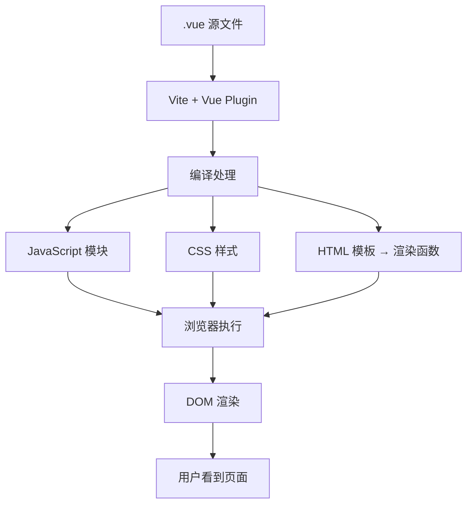

# Vue 单文件组件 (SFC) 处理机制详解

## 📋 概述

本文档详细解释了 Vue 单文件组件 (`.vue` 文件) 在浏览器中的处理过程，包括编译机制、依赖关系、渲染流程以及开发工具链的作用。

**核心问题解答**: 浏览器最终显示的内容并不是 `.vue` 文件本身，而是经过编译工具 (Vite + @vitejs/plugin-vue) 处理后的 JavaScript、CSS 和 HTML 代码。

---

## 🔄 Vue 文件处理流程概览



---

## 🧩 Vue 单文件组件结构

### 典型 .vue 文件结构

```vue
<!-- HelloWorld.vue -->
<template>                    <!-- 1. 模板部分 -->
    <div class="weather-component">
        <h1>Weather forecast</h1>
        <div v-if="loading">Loading...</div>
        <table v-if="post">
            <tr v-for="item in post" :key="item.date">
                <td>{{ item.date }}</td>
                <td>{{ item.temperatureC }}</td>
            </tr>
        </table>
    </div>
</template>

<script lang="ts">             <!-- 2. 脚本部分 -->
import { defineComponent } from 'vue';

export default defineComponent({
    data() {
        return {
            loading: false,
            post: null
        };
    },
    methods: {
        async fetchData() {
            // API 调用逻辑
        }
    }
});
</script>

<style scoped>                <!-- 3. 样式部分 -->
.weather-component {
    text-align: center;
}
table { margin: 0 auto; }
</style>
```

### 三个部分的作用

| 部分 | 作用 | 编译后的形态 |
|------|------|-------------|
| `<template>` | 定义组件的 HTML 结构和 Vue 指令 | JavaScript 渲染函数 |
| `<script>` | 定义组件的逻辑、数据、方法 | ES6 模块 JavaScript |
| `<style>` | 定义组件的样式 | CSS 代码 (可能带作用域) |

---

## ⚙️ 编译工具链详解

### 1. Vite 配置文件

```typescript
// vite.config.ts
import { defineConfig } from 'vite';
import plugin from '@vitejs/plugin-vue';  // Vue SFC 编译插件

export default defineConfig({
    plugins: [plugin()],                  // 启用 Vue 单文件组件支持
    resolve: {
        alias: {
            '@': fileURLToPath(new URL('./src', import.meta.url))
        }
    },
    // ...其他配置
});
```

### 2. @vitejs/plugin-vue 插件功能

| 功能 | 作用 | 示例 |
|------|------|------|
| **模板编译** | 将 Vue 模板语法转换为渲染函数 | `v-if` → JavaScript 条件语句 |
| **脚本处理** | 处理 TypeScript 和 Composition API | `<script setup>` 语法糖解析 |
| **样式提取** | 处理 CSS 预处理器和作用域样式 | `scoped` 样式隔离 |
| **热重载** | 开发时组件级别的热更新 | 保存文件立即更新浏览器 |

---

## 🔄 编译过程详解

### 1. 模板编译

#### 原始模板
```vue
<template>
    <div v-if="loading" @click="handleClick">
        {{ message }}
    </div>
    <ul v-else>
        <li v-for="item in items" :key="item.id">
            {{ item.name }}
        </li>
    </ul>
</template>
```

#### 编译后的渲染函数
```javascript
import { createElementVNode as _createElementVNode, Fragment as _Fragment, 
         renderList as _renderList, toDisplayString as _toDisplayString } from 'vue';

function render(_ctx, _cache) {
    return (_ctx.loading) 
        ? _createElementVNode("div", {
            onClick: _ctx.handleClick
          }, _toDisplayString(_ctx.message), 1)
        : _createElementVNode("ul", null, [
            (_renderList(_ctx.items, (item) => {
                return _createElementVNode("li", { 
                    key: item.id 
                }, _toDisplayString(item.name), 1)
            }))
          ]);
}
```

### 2. 脚本处理

#### 原始脚本 (Composition API)
```vue
<script setup lang="ts">
import { ref, onMounted } from 'vue';

interface WeatherData {
    date: string;
    temperature: number;
}

const loading = ref<boolean>(false);
const weatherData = ref<WeatherData[]>([]);

const fetchWeatherData = async () => {
    loading.value = true;
    try {
        const response = await fetch('/api/weather');
        weatherData.value = await response.json();
    } finally {
        loading.value = false;
    }
};

onMounted(() => {
    fetchWeatherData();
});
</script>
```

#### 编译后的组件定义
```javascript
import { ref, onMounted, defineComponent } from 'vue';

export default defineComponent({
    name: 'WeatherComponent',
    setup() {
        const loading = ref(false);
        const weatherData = ref([]);

        const fetchWeatherData = async () => {
            loading.value = true;
            try {
                const response = await fetch('/api/weather');
                weatherData.value = await response.json();
            } finally {
                loading.value = false;
            }
        };

        onMounted(() => {
            fetchWeatherData();
        });

        return {
            loading,
            weatherData,
            fetchWeatherData
        };
    },
    render
});
```

### 3. 样式处理

#### 原始样式
```vue
<style scoped>
.weather-component {
    padding: 20px;
    background: #f5f5f5;
}

.loading {
    color: #666;
    font-style: italic;
}
</style>
```

#### 编译后的样式
```css
/* 生成唯一的作用域标识符 */
.weather-component[data-v-7ba5bd90] {
    padding: 20px;
    background: #f5f5f5;
}

.loading[data-v-7ba5bd90] {
    color: #666;
    font-style: italic;
}
```

#### 对应的 HTML 输出
```html
<div class="weather-component" data-v-7ba5bd90>
    <div class="loading" data-v-7ba5bd90>Loading...</div>
</div>
```

---

## 🏗️ 项目依赖关系图

### 完整依赖关系

```
index.html (浏览器入口)
    ↓ <script src="/src/main.ts">
main.ts (应用入口)
    ├─→ './assets/main.css' (全局样式)
    ├─→ 'vue' (Vue 3 框架)
    └─→ './App.vue' (根组件)
            ├─→ './components/HelloWorld.vue' (天气组件)
            │     └─→ fetch('/weatherforecast') (API 调用)
            └─→ './components/TheWelcome.vue' (欢迎组件)
                    ├─→ './WelcomeItem.vue' (项目组件 × 5)
                    └─→ './icons/' (图标组件系列)
                            ├─→ IconDocumentation.vue
                            ├─→ IconTooling.vue
                            ├─→ IconEcosystem.vue
                            ├─→ IconCommunity.vue
                            └─→ IconSupport.vue
```

### 依赖类型分析

| 依赖类型 | 示例 | 处理方式 |
|----------|------|----------|
| **组件依赖** | `import HelloWorld from './HelloWorld.vue'` | 编译为 JavaScript 模块 |
| **样式依赖** | `import './assets/main.css'` | 注入到页面或打包为 CSS 文件 |
| **库依赖** | `import { createApp } from 'vue'` | 从 node_modules 加载 |
| **资源依赖** | `src="./assets/logo.svg"` | 复制到输出目录或转为 data URL |
| **API 依赖** | `fetch('/weatherforecast')` | 运行时网络请求 |

---

## 🌐 浏览器执行过程

### 1. 页面加载时序

```
1. 用户访问 https://localhost:5157/
   ↓
2. 浏览器请求 index.html
   ↓
3. HTML 解析发现 <script type="module" src="/src/main.ts">
   ↓
4. 浏览器请求 /src/main.ts (ES 模块)
   ↓
5. Vite 拦截请求，实时编译：
   - main.ts → JavaScript
   - App.vue → JavaScript + CSS
   - 所有依赖的 .vue 文件
   ↓
6. 返回编译后的 JavaScript 给浏览器
   ↓
7. 浏览器执行 JavaScript：
   - 创建 Vue 应用实例
   - 挂载到 #app DOM 元素
   ↓
8. Vue 响应式系统启动，组件开始渲染
   ↓
9. 用户看到完整页面
```

### 2. 开发模式 vs 生产模式

#### 开发模式 (npm run dev)
```
.vue 文件 → Vite 实时编译 → 浏览器执行 → 热重载更新
```
- **特点**: 实时编译，源码映射，热重载
- **优点**: 开发效率高，调试方便
- **缺点**: 文件多，加载略慢

#### 生产模式 (npm run build)
```
.vue 文件 → 预编译打包 → dist/ 目录 → 部署到服务器 → 浏览器加载
```
- **特点**: 预编译，代码分割，压缩优化
- **优点**: 加载快，体积小，性能好
- **缺点**: 构建时间长，不能实时修改

---

## 🔍 浏览器中的实际内容

### 1. Network 面板中看到的请求

```
开发模式下的网络请求：
GET /                          → index.html
GET /src/main.ts              → 编译后的 main.js
GET /src/App.vue              → 编译后的 App.js
GET /src/components/HelloWorld.vue → 编译后的 HelloWorld.js
GET /src/assets/main.css      → CSS 文件
GET /src/assets/logo.svg      → SVG 资源文件
```

### 2. Sources 面板中的文件结构

```
Sources 面板显示：
├── localhost:5157/
│   ├── src/
│   │   ├── main.ts (编译后，但保留源码映射)
│   │   ├── App.vue (显示为 JavaScript)
│   │   └── components/
│   │       ├── HelloWorld.vue (显示为 JavaScript)
│   │       └── TheWelcome.vue (显示为 JavaScript)
│   └── node_modules/
│       └── vue/ (Vue 框架代码)
```

### 3. Elements 面板中的 DOM 结构

```html
<!DOCTYPE html>
<html>
<head>
    <title>Vite App</title>
    <style>
    /* 编译后的 CSS 样式 */
    .weather-component[data-v-7ba5bd90] { text-align: center; }
    </style>
</head>
<body>
    <div id="app">
        <!-- Vue 组件渲染的实际 DOM -->
        <header>
            
            <div class="wrapper">
                <div class="weather-component" data-v-7ba5bd90>
                    <h1>Weather forecast</h1>
                    <table>
                        <thead>
                            <tr>
                                <th>Date</th>
                                <th>Temp. (C)</th>
                                <th>Temp. (F)</th>
                                <th>Summary</th>
                            </tr>
                        </thead>
                        <tbody>
                            <tr>
                                <td>2025-08-22</td>
                                <td>25</td>
                                <td>77</td>
                                <td>Warm</td>
                            </tr>
                        </tbody>
                    </table>
                </div>
            </div>
        </header>
        <main>
            <!-- TheWelcome 组件内容 -->
            <div class="item">
                <i><svg><!-- 图标内容 --></svg></i>
                <div class="details">
                    <h3>Documentation</h3>
                    <p>Vue's official documentation provides...</p>
                </div>
            </div>
        </main>
    </div>

    <!-- Vue DevTools 注入的脚本 -->
    <script>/* Vue DevTools detection */</script>
</body>
</html>
```

---

## 🛠️ 调试和开发工具

### 1. Vue DevTools 浏览器扩展

安装 Vue DevTools 后可以看到：

#### Components 面板
```
<Root>
  ├─ <App>
  │  ├─ <HelloWorld> msg="You did it!"
  │  │  ├─ loading: false
  │  │  └─ post: Array[5] ← 天气数据
  │  └─ <TheWelcome>
  │     ├─ <WelcomeItem> × 5
  │     └─ <Icon*> × 5 (各种图标组件)
```

#### Timeline 面板
```
Performance 时间线：
├─ App created
├─ HelloWorld created
├─ HelloWorld mounted
├─ API call: /weatherforecast
├─ Data updated: post
└─ UI re-rendered
```

### 2. 浏览器开发者工具集成

#### Source Map 支持
```
开发模式下可以直接调试 .vue 文件：
- 在 .vue 文件中设置断点
- 查看组件的 data、props、computed
- 监控响应式数据的变化
```

#### Hot Module Replacement (HMR)
```
文件修改 → Vite 检测变化 → 重新编译 → 推送更新到浏览器 → 保持应用状态
```

---

## 🚀 性能优化和最佳实践

### 1. 编译优化

#### Tree Shaking (摇树优化)
```javascript
// 只导入使用的 Vue 功能
import { ref, onMounted } from 'vue';  // ✅ 只打包使用的函数
// import * as Vue from 'vue';        // ❌ 打包整个 Vue
```

#### 代码分割
```javascript
// 路由级别的懒加载
const HomePage = () => import('./components/HomePage.vue');
const AboutPage = () => import('./components/AboutPage.vue');
```

### 2. 开发体验优化

#### TypeScript 支持
```vue
<script setup lang="ts">
import { ref } from 'vue';

// 类型推断和检查
const count = ref<number>(0);
const message = ref<string>('Hello');

// 组件 Props 类型定义
interface Props {
  title: string;
  count?: number;
}
defineProps<Props>();
</script>
```

#### CSS 预处理器支持
```vue
<style lang="scss" scoped>
$primary-color: #42b883;

.component {
  color: $primary-color;
  
  &:hover {
    color: darken($primary-color, 10%);
  }
}
</style>
```

---

## 📋 总结

### 🎯 核心要点

1. **`.vue` 文件不会直接在浏览器中执行**，而是通过 Vite + Vue 插件编译成标准的 HTML、CSS 和 JavaScript

2. **编译过程包括三个主要部分**：
   - 模板 → 渲染函数
   - 脚本 → ES 模块  
   - 样式 → CSS (可能带作用域)

3. **依赖关系形成树形结构**，从入口文件开始逐层解析和编译

4. **开发和生产模式的处理方式不同**：
   - 开发模式：实时编译，热重载
   - 生产模式：预编译，优化打包

### 🔄 完整数据流

```
.vue 源文件 → Vite 编译 → JavaScript 模块 → 浏览器执行 → DOM 渲染 → 用户界面
```

### 🛠️ 关键工具

- **Vite**: 现代构建工具，提供快速的开发服务器
- **@vitejs/plugin-vue**: Vue SFC 编译插件
- **Vue DevTools**: 组件调试工具
- **TypeScript**: 类型检查和智能提示

这种编译机制让我们可以使用现代的组件化开发方式，同时保证浏览器的兼容性和性能！🚀
