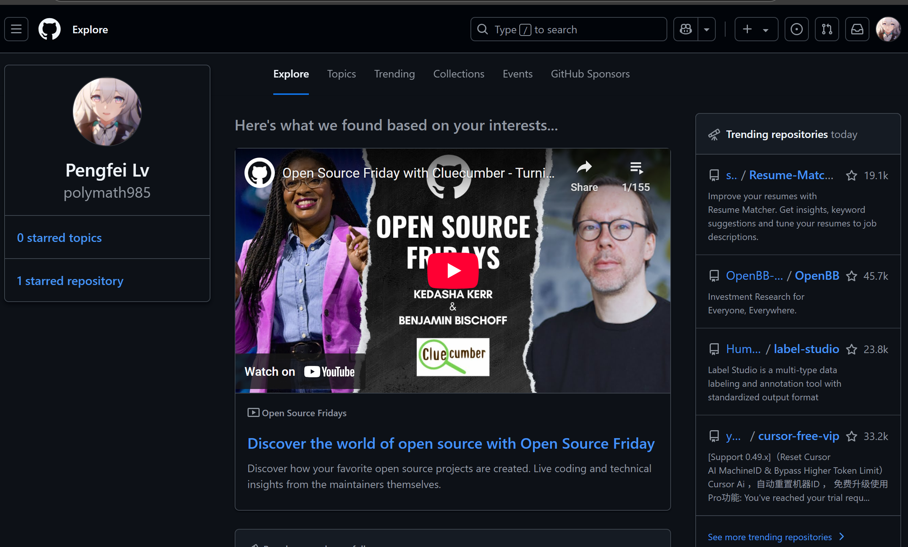
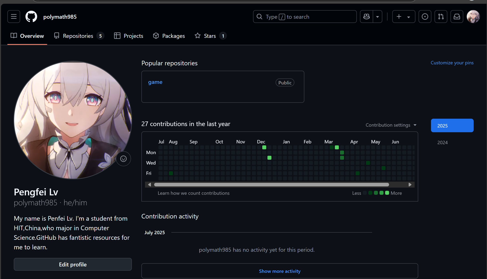
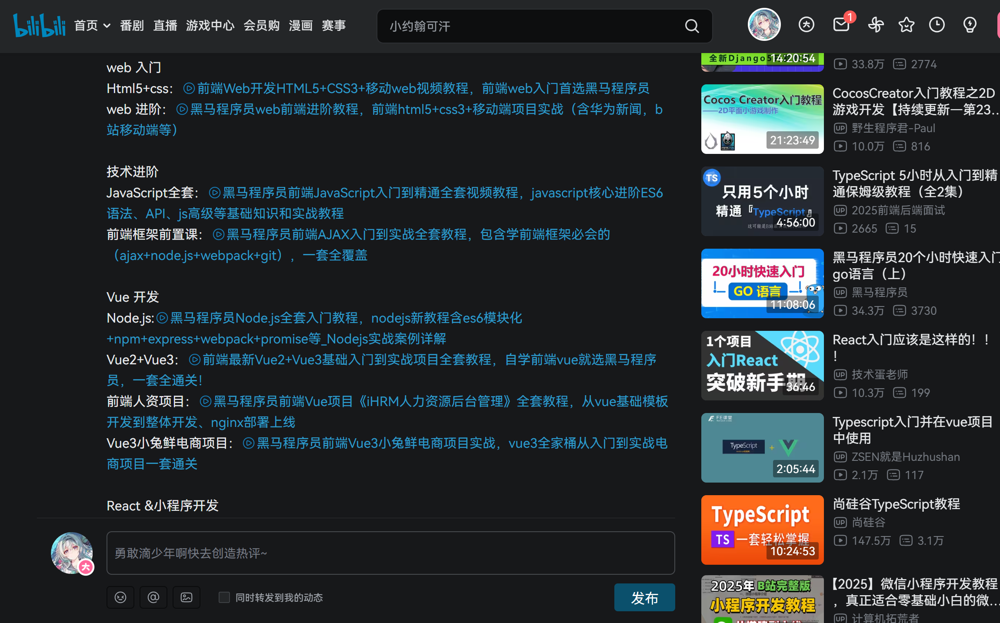

# 需求文档
## 概述
我们的目的是开发一个可以被公网域名访问，典型的前后端分离的个人博客项目。我们可以注册，登录或是以游客(默认)访问网站，在网站上已经注册的人可以发布个人技术文档，提供项目下载链接，发布动态，评论，以及技术问题的issue
## 功能需求
### 登录系统
- 默认以游客登录，只有部分读(read)的权限
- 右上角可以选择登录注册，以及点击头像查看个人空间
- 登录界面简单使用账号密码形式

### 主页
- 推送一些已注册用户发布的内容
- 有到其他地方的导航栏，链接各处

### 个人空间
- 在这里可以看到用户的完整信息，如项目，技术文档，动态，发布的issue
- 可以在个人空间下留言
- 可以下载项目(如果有)，提供转向github或者直接下载到链接
  

*图：以github为蓝本进行参考*

### 简单的搜索功能
- 通过顶部的搜索栏进行用户，项目，文档的搜索

### 发布项目
- 点击发布项目，打开本地资源管理器，可以上传本地项目
-  此外，还可以选择发布git链接

### 发布技术文档
- 在线编辑markdown
- 直接从本地资源管理器上传，服务器解析

### 发布评论
- 和主流软件一个逻辑

*图：B站评论*